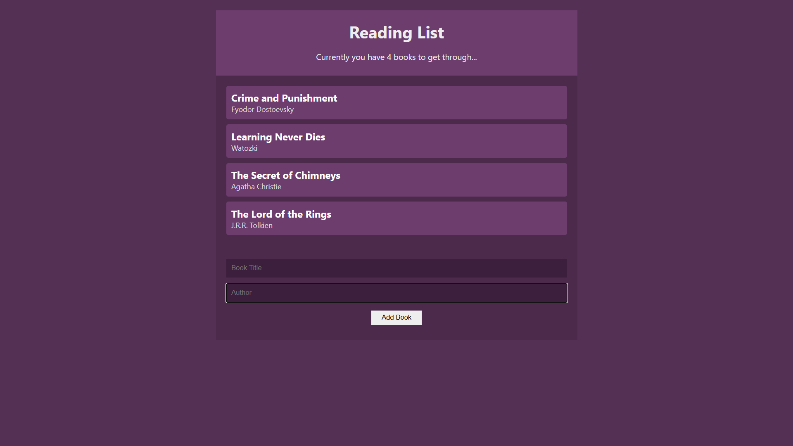

# React Book List

> Book List app built with React and along with Context and Hooks API for state management. Used local storage to store key value pairs.

[http://abshekh.github.io/React-Book-List](http://abshekh.github.io/React-Book-List)



## Quick Start

### Install Dependencies (frontend)

```bash
# Install dependencies
npm install
```

### Run

```bash
# Run the client
npm start

# Client runs on http://localhost:3000
```
